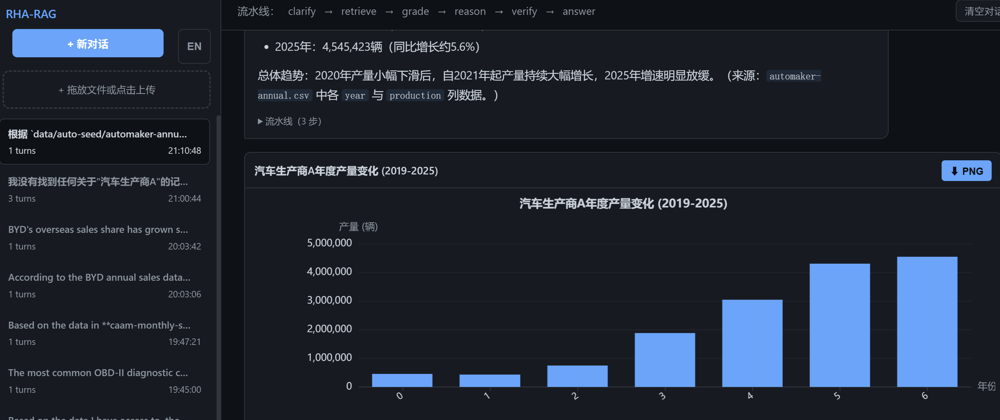

# RHA-RAG

[English](README.md) | [中文](README_zh.md)

**推理增强型智能 RAG** — 上传文档，提出问题，观察 AI 智能体逐步执行检索、评分、逻辑推理、演绎验证，最终生成带引用的答案。基于 [LangGraph](https://langchain-ai.github.io/langgraph/) 构建。

[](LICENSE)
[](https://www.python.org/)

<hr>

## 快速开始

```bash
# 1. 安装依赖
pip install -r requirements.txt

# 2. 设置 API 密钥
export ZAI_API_KEY="..."      # Z.ai — GLM-OCR 光学识别
export QWEN_API_KEY="..."     # Qwen/DashScope — 文本嵌入
export OPENAI_API_KEY="..."   # DeepSeek — 大语言模型

# 3. 启动服务
python server.py              # → http://localhost:8000
```

上传文档（或放入 `data/local/` 目录），输入研究问题，即可实时观看流水线执行过程。



## 工作原理

```
用户提问
    │
    ▼
clarify          将自然语言转化为目标驱动的逻辑命题
    │
    ▼
generate_query   LLM 决定：检索知识库，还是直接回答
    │
    ├──(无需检索)── END
    │
    ▼
retrieve         对本地向量库进行语义搜索
    │
    ▼
grade            使用结构化 LLM 输出评估文档相关性
    │
    ▼
reason           构建逻辑证明链（@cite / @common / @MP / @TA）
    │
    ▼
verify           逐条验证推理步骤是否符合演绎规则
    │
    ▼
generate_answer  生成最终答案并附上明确的文献引用
```

每个节点的输出通过 Server-Sent Events 实时推送到 Web 界面。

## 架构

| 组件 | 技术栈 |
|-----------|-----------|
| 编排 | LangGraph `StateGraph`（7 个节点，条件边） |
| LLM | DeepSeek V4 Pro（通过 `ChatDeepSeekFixed`） |
| 嵌入 | 千问 `text-embedding-v4`（批次上限 10） |
| OCR | GLM-OCR（Z.ai `ZaiClient`，data URI 格式） |
| 向量库 | LangChain `InMemoryVectorStore` |
| PDF 渲染 | PyMuPDF（逐页 → PNG → OCR） |
| Web 服务器 | FastAPI + SSE 流式传输 |

## 支持的文档类型

将以下文件放入 `data/local/` 或通过 Web 上传：

| 类型 | 扩展名 | 处理方式 |
|------|-----------|------------|
| 纯文本 | `.txt` `.md` | 直接读取 |
| HTML | `.html` `.htm` | BeautifulSoup 文本提取 |
| Word | `.docx` | PyMuPDF |
| PDF | `.pdf` | GLM-OCR（逐页渲染为 PNG 后识别） |
| 图片 | `.jpg` `.jpeg` `.png` | GLM-OCR |

## 项目结构

```
.
├── server.py              FastAPI Web 服务器 + API
├── run.py                 CLI 命令行工具（输出 → run.log）
├── rha_rag/                核心包
│   ├── llm.py             ChatDeepSeekFixed + 模型配置
│   ├── pipeline.py        文档加载、OCR（含 .ocr.md 缓存）、嵌入、向量库
│   └── graph.py           LangGraph 节点 + 图谱组装
├── prompts/               LLM 提示词模板（运行时加载）
├── templates/
│   └── index.html         Web 界面（暗色主题，流式传输）
├── data/local/            将文档放入此目录
├── uploads/               或通过 Web 界面上传
├── requirements.txt
├── .env.example
└── LICENSE
```

## API 接口

| 方法 | 路径 | 说明 |
|--------|------|-------------|
| `GET` | `/` | Web 界面 |
| `GET` | `/api/status` | 系统状态（`ready`、`documents`、`chunks`、`errors`） |
| `GET` | `/api/files` | 列出 `uploads/` 和 `data/local/` 中的所有文件 |
| `POST` | `/api/upload` | 上传文档（multipart 表单） |
| `DELETE` | `/api/files/{name}` | 删除已上传的文件 |
| `POST` | `/api/reindex` | 强制重建文档索引 |
| `POST` | `/api/chat` | 提出问题 → SSE 流式返回各节点输出 |

## CLI 命令行用法

```bash
python run.py "什么是紧集？"
# 或交互式：
python run.py
# 或管道输入：
echo "定义连续性" | python run.py
```

输出同时写入 stdout 和 `run.log`。使用与 Web 服务器相同的流水线。

## 配置

将 `.env.example` 复制为 `.env`：

| 变量 | 服务 | 用途 |
|----------|---------|---------|
| `ZAI_API_KEY` | [Z.ai](https://www.z.ai/) | GLM-OCR PDF/图片识别 |
| `QWEN_API_KEY` | [DashScope](https://dashscope.aliyun.com/) | 千问 text-embedding-v4 |
| `OPENAI_API_KEY` | [DeepSeek](https://api.deepseek.com) | DeepSeek V4 Pro LLM |

未设置密钥时服务器仍可启动 — 先上传文件，再设置密钥后点击 **Re-index**。

## DeepSeek V4 补丁

`ChatDeepSeekFixed` 修复了与 DeepSeek V4 思考模式的三个不兼容问题：

1. **`reasoning_content` 保留** — 工具调用往返过程中必需；LangChain 会丢弃此字段
2. **列表内容序列化** — 类型为列表的 tool/assistant 消息内容需要转为字符串
3. **`tool_choice` 降级** — 思考模式拒绝 `{"type":"function",...}`；强制改为 `"auto"`

详见 [langchain-ai/langchain#37178](https://github.com/langchain-ai/langchain/issues/37178)。

## 许可证

MIT — 详见 [LICENSE](LICENSE)。
